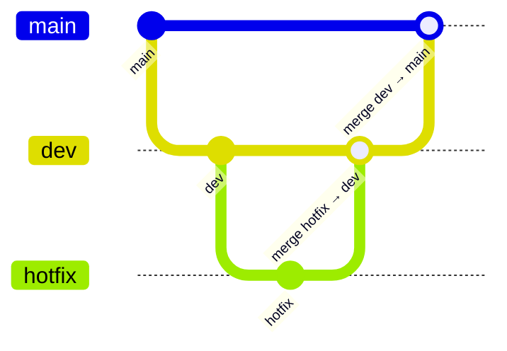

# abrigo-helena-dornfeld-front


Este repositório contém o código-fonte do projeto **[Nome do Projeto]**, mantido com controle rigoroso de branches e políticas de PR para garantir estabilidade e organização no fluxo de desenvolvimento.

---

## Como utilizar

1. **Instale as dependências**

   ```bash
   pnpm install
   ```

   Isso instalará todas as dependências necessárias do projeto.

2. **Execute o projeto**

   Após a instalação, use os scripts disponíveis (por exemplo):

   ```bash
   pnpm run dev
   ```

   > Consulte o `package.json` para ver todos os scripts disponíveis.

---

## Estrutura de Branches

O repositório segue uma estrutura simples e padronizada de branches:

| Branch | Função | Permissão de Push |
|--------|--------|-------------------|
| **main** | Versão estável do código em produção | Protegida (sem push direto) |
| **dev** | Ambiente principal de desenvolvimento | Via Pull Request |
| **hotfix** | Correções urgentes e pontuais | Via Pull Request |

---

## Regras de Push e Pull Requests

- Nenhum push direto é permitido na branch **main**.  
- Todo código deve ser enviado via **Pull Request (PR)**.  
- As PRs podem ter origem:
  - da branch **dev**, para desenvolvimento normal;
  - ou da branch **hotfix**, para correções urgentes.

> ⚠️ Somente PRs aprovadas e revisadas podem ser mescladas na `main`.

---

## 🧱 Fluxo de Desenvolvimento



---

## Observações

- Sempre crie uma nova branch local a partir de **dev** antes de iniciar uma feature.
- Antes de abrir um PR, garanta que o código foi testado e passou nas verificações automáticas (se houver).
- Commits devem ser descritivos e seguir boas práticas de versionamento.

---

## Requisitos

- Node.js (versão compatível com o projeto)
- pnpm (para gerenciamento de dependências)

---